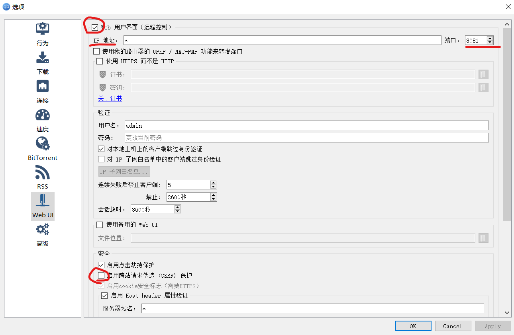
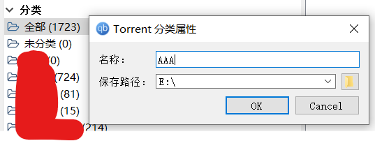

# AutoPT  
  

## 简介  
This is a program for auto download PT torrents. It uses QBittorrent to manage torrents and disk capacity.  
此程序用于自动下载PT免费种子，并自动辅种和一体化管理。开发目的为了释放双手，专注观影！  

## 特别感谢  
感谢[忘川](https://github.com/ledccn)  大佬，此程序的辅种功能是在大佬的api基础上开发的。[
仓库直链](https://github.com/ledccn/IYUUAutoReseed)  

## 支持环境  
Works on QBittorrent version 4.1.9-4.2.5, Windows 10  
支持win10下使用QB4.1.9-4.2.5版本。(其他版本不一定兼容)  

## 支持站点  
Support PT Station: BYR, TJU, PTER, MTeam, PTHome, FRDS, TTG, LEMONHD  
暂时支持北邮、北洋、猫站、馒头、铂金、朋、套、柠檬, 拿到药后再支持更多.  

食用教程  
=
1、安装python  
[教程直链](https://www.liaoxuefeng.com/wiki/1016959663602400/1016959856222624)  

2、进入到项目根目录,安装python库  
`pip install -r requirements.txt`  

3、如图设置qb web，并设置登录用户名密码  
  

4、如图设置QB分类(必须填写保存路径)  
  

5、复制`config.json.backup`并重命名为`config.json`  
并打开`config.json`填写配置文件(请严格按照大小写来填写  
**备注：**  
```要设置"switch":true才会开启对应站点的脚本```  
```若需开启仅签到模式，也需要将对应站点总开关设置为 true ```  
```
接管分类仅仅在删除种子时生效，例如 
 "MainCategory": [
      "AAA",
      "BBB",
      "CCC",
    ]
则下载此站点种子的时候会保存在AAA这个分类下，
在磁盘空间不够时会从AAA,BBB,CCC这三个分类中去删除最不活跃的种子直到有足够容量能下载新种子，且其他分类种子不会被删除
```

6、进入项目根目录,运行脚本  
`python Main.py`  

脚本运行事项
=
```若无法获取站点的种子信息,则到cookies文件夹里删除对应站点的cookies缓存再重新运行脚本登录即可```  


## 参考代码  
[@zYeoman](https://gist.github.com/zYeoman/1d841c5a1227697bc82c81f4acf1f2ad)  
